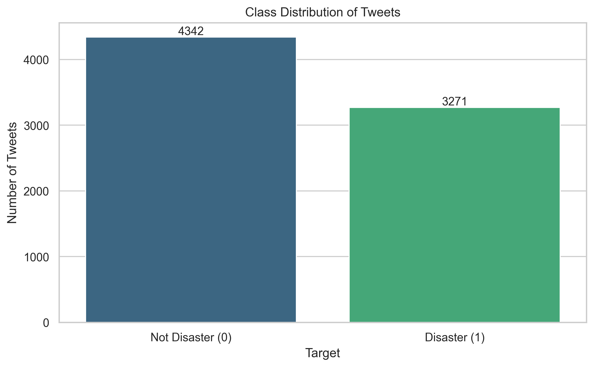
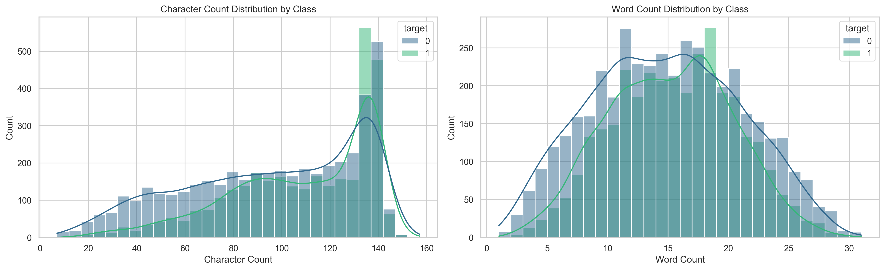
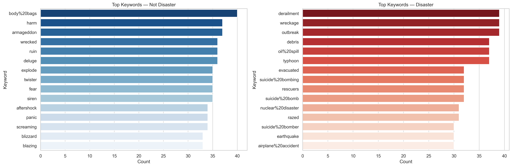
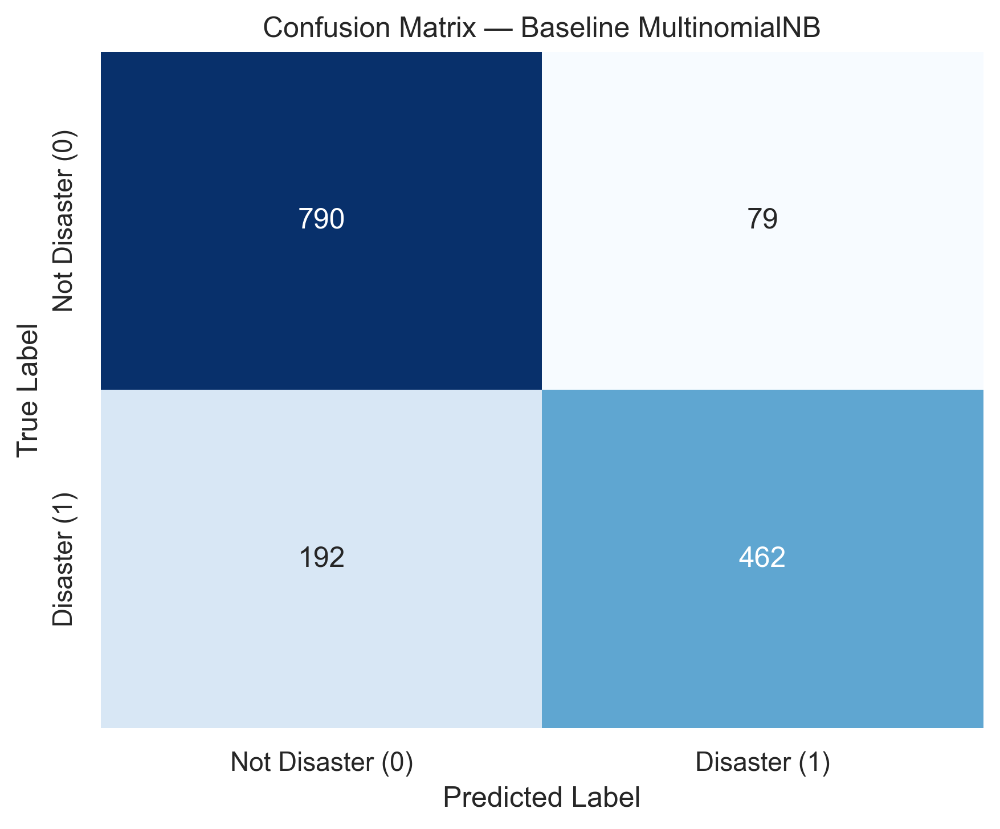

# Disaster Tweet Classification

Binary text classification — distinguishing tweets about real disasters from figurative language using classical NLP.

**Kaggle Competition:** [NLP with Disaster Tweets](https://www.kaggle.com/competitions/nlp-getting-started/overview)
**Public Leaderboard F1:** [fill in after submission]

---

## Problem

Twitter is used to report emergencies in real time. But disaster vocabulary is used figuratively constantly — "this traffic is a disaster", "the concert was fire", "I'm dying of boredom". An automated classifier that identifies genuine disaster tweets allows crisis monitoring systems to filter signal from noise at scale.

The task: given a tweet's text, predict whether it refers to a real disaster (1) or not (0).

---

## Approach

```
Raw Tweet Text
      ↓
Text Cleaning (URLs, mentions, punctuation)
      ↓
Tokenization + Stopword Removal + Lemmatization
      ↓
TF-IDF Vectorization (fit on training data only)
      ↓
Classifier (Naive Bayes → Logistic Regression → LinearSVC)
      ↓
Evaluation (F1, Precision, Recall, Error Analysis)
```

---

## Dataset

| Split | Rows  | Source                                     |
| ----- | ----- | ------------------------------------------ |
| Train | 7,613 | `train.csv`                                |
| Test  | 3,263 | `test.csv` (no labels — Kaggle submission) |

**Columns:** `id`, `keyword`, `location`, `text`, `target`

**Class distribution:** 57% non-disaster (0), 43% disaster (1)

---

## Text Preprocessing Pipeline

1. Lowercase all text
2. Remove URLs (`https?://\S+`)
3. Remove @mentions
4. Remove HTML entities and special characters
5. Tokenize with NLTK
6. Remove English stopwords
7. Lemmatize tokens (WordNetLemmatizer)
8. Rejoin into cleaned string

**Critical design decision:** TF-IDF vectorizer is fit exclusively on the training split. Fitting on the full dataset before splitting would be data leakage — validation scores would be artificially inflated because the vectorizer would have already "seen" the vocabulary distribution of the validation set.

---

## Model Comparison

> Fill in after experiments complete (Day 4–5)

| Model                                | F1 (val) | Precision | Recall | Notes             |
| ------------------------------------ | -------- | --------- | ------ | ----------------- |
| Majority class baseline              | ~0.0     | —         | 0.0    | Always predicts 0 |
| MultinomialNB + unigram TF-IDF       |          |           |        | Baseline          |
| Logistic Regression + unigram TF-IDF |          |           |        |                   |
| Logistic Regression + bigram TF-IDF  |          |           |        |                   |
| LinearSVC + bigram TF-IDF            |          |           |        |                   |
| **Best model**                       |          |           |        |                   |

---

## Error Analysis

> Fill in after Day 5

**False Positives — model predicted disaster, tweet was not:**

The model is confused by figurative disaster language. Examples:

| Tweet     | Prediction | Actual |
| --------- | ---------- | ------ |
| [example] | 1          | 0      |
| [example] | 1          | 0      |

**False Negatives — real disaster tweet the model missed:**

| Tweet     | Prediction | Actual |
| --------- | ---------- | ------ |
| [example] | 0          | 1      |
| [example] | 0          | 1      |

**Patterns identified:** [fill in]

---

## Key Visualizations

**Class Distribution**


**Tweet Length by Class**


**Top Keywords by Class**


**Confusion Matrix — Best Model**


---

## Project Structure

```
disaster-tweet-classification/
├── data/                    # Kaggle CSVs (not committed)
├── notebooks/
│   ├── 01_eda.ipynb
│   ├── 02_preprocessing.ipynb
│   └── 03_modeling_evaluation.ipynb
├── docs/                    # Full project documentation
├── outputs/
│   ├── submission.csv
│   └── figures/
├── requirements.txt
└── README.md
```

---

## Setup

```bash
git clone https://github.com/KaustubhMukdam/disaster-tweet-classification.git
cd disaster-tweet-classification
pip install -r requirements.txt
```

Download the dataset from [Kaggle](https://www.kaggle.com/competitions/nlp-getting-started/data) and place `train.csv`, `test.csv`, `sample_submission.csv` in the `data/` directory.

Then run notebooks in order: `01_eda` → `02_preprocessing` → `03_modeling_evaluation`.

---

## Requirements

```
pandas>=2.0
numpy>=1.26
scikit-learn>=1.4
nltk>=3.8
matplotlib>=3.7
seaborn>=0.13
wordcloud>=1.9
jupyter
```

---

## What I Learned

The most interesting finding from this project wasn't the F1 score — it was the error analysis. Reading the false positives and false negatives manually revealed that the model's failure mode is almost entirely **figurative vs. literal disaster language**. The tokens are the same; the context and intent are different. This is exactly the limitation that bag-of-words models can't solve, and it's the reason transformer-based models (which capture context) dominate on this task.

[Fill in with honest reflection after completing the project]

---

## Future Improvements

- Character-level n-gram TF-IDF as an additional feature
- Soft-vote ensemble of Logistic Regression + LinearSVC
- DistilBERT fine-tuning for semantic context understanding
- `keyword` column as an additional engineered feature

---

## Results

**Kaggle Public Leaderboard F1:** [fill in]

Part of my AI/ML internship preparation portfolio. Previous projects: [Heart Disease Detection](https://github.com/KaustubhMukdam/heart-disease-predictor) | [Telecom Churn Prediction](https://github.com/KaustubhMukdam/customer-churn-prediction) | [Retail Sales Forecasting](https://github.com/KaustubhMukdam/retail-sales-forecasting)
